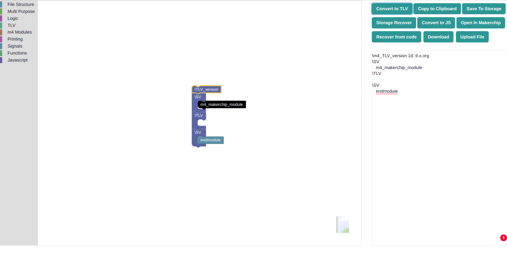

# Block Based Circuit Design

This summer I mentored under the FOSSi Foundation to develop a Block Based Circuit Design Solution using blockly by google. I am excited to introduce to you the result! 


<a href="https://gsoc-block-based-circuit-design-site.netlify.app/"></a>

## Motivation

Block-Based Circuit Design introduces learners to circuit design at a young age. The current options available for circuit design like Verilog and VHDL are syntactically hard for the younger learners to grasp. TL-Verilog, a variation of Verilog helps eliminate this complexity from the languages while preserving its advantages. 

Block Based Circuit Design takes it a step further. By Gamification of the learning and working process, it makes learning and tinkering with Circuit design fun. Further tearing down barriers to entry to the field.

## What We Have Achieved This Summer

**Block Based Circuit Designer** has been Developed and Deployed from ground up. The solution is available to the users at [website-url](https://gsoc-block-based-circuit-design-site.netlify.app/").


|**Proposed Deliverables**                                             |**Status**   | 
|----------------------------------------------------------------------|------------:|
| Designing the required tool list for the interface.                  | Delivered   |
| Create a working custom Language Generator for TL-Verilog on Blocky. | Delivered   |
| Adding instructions to the language generator to handle more tasks   | Delivered   | 
| Exploring and possibly implementing big string text inputs in Blocky | Delivered   |


### The Technologies used in the Project include:
- Blockly
- TL-Verilog
- React
- Chakra-UI
- Core JavaScript and JSON
- netlify for deployment
- MakerchipIDE

### Understanding the Code 

```
├── App.css
├── App.js
├── components
│   ├── BlocklyComponent
│   │   ├── BlocklyComponent.jsx
│   │   └── index.js
│   ├── Panel.js
│   └── toolbox.js
├── generator
│   ├── Components.js
│   ├── Expressions.js
│   ├── fileStructure.js
│   ├── m4Modules.js
│   ├── MultiPurpose.js
│   ├── Printing.js
│   ├── Procedures.js
│   ├── Scopes.js
│   ├── Sequential.js
│   ├── Signals.js
│   ├── Ternary.js
│   └── tl_verilog.js
└── index.js
```

The Code went through a lot of rounds and I took to recode everything again from scratch post the 1st evaluation. This was done to deliver the most efficient solution for the product. 

In our src we have :
```
├── components
├── generator
├── App.css
├── App.js
└── index.js
```
The **components folder** holds the code for the three main sections of our solution:
  - Toolbox (Leftmost)
  - Blockly Workspace(middle)
  - Panel (rightmost)
  -
These folder contain the necessary logic to render and handle any changes made by the user on these specific areas. These can be thought of as canvases for their individual zones

The **generator folder** carries the description and logic for all the blocks that the Designer is equipped with. 

The *tl-verilog.js* file defines our custom generator 

## Daily Tracker
- [My Daily Updates](../gsoc-2021)


## Work Done

- [Github Repository](https://github.com/ninja3011/Block_Based_Circuit_Design)
- [Website](https://gsoc-block-based-circuit-design-site.netlify.app/)
- [Daily Tracker](../gsoc-2021) 
