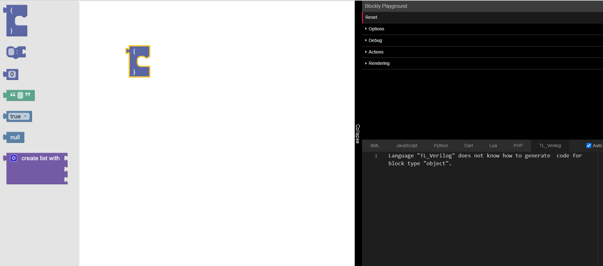
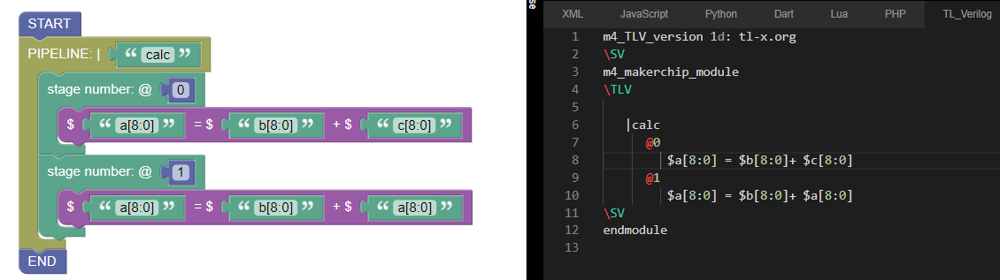

/ [Home](/index) / [Tracker](/gsoc-2021) / [About](pages/gsoc/about) / [TL-Verilog](pages/gsoc/TLV) / [Blogs](pages/blogs/gsoc-final-blog) /

---

### Week 0.1

---

1. **20/05/2021:** 
   * added a TL Verilog Generator to code into
   * The generator main script is tl_verilog.js, currently in playgrounds.
   * The playground is advanced_playground

    

2. **21/05/2021:**
   * Learned how to generate code for a block. 
   * Blocks with prebuilt strings can be used for general-purpose statements 

    

3. **22/05/2021:**
   * Made Custom blocks for a basic pipeline
   * added the code for its JSON and js code generator.
   * “facing some errors with the integration of custom blocks”
   * Implemented a buggy TLV block program
   * bugs:
         1. subsequent codes don't come when the blocks are joined
         2. even though the |'calc' and $'cc..' stuff is one string they are coming separately
         3. indent is missing

    
    

4. **23/05/2021:**
   * Fixed the style of the block to better resemble the vision
   * Read the cake.js and Browsed over the general advanced_playground.html
   * Issues: 
           * When a block is connected to the chain it just ignores the lower blocks code. Only the up-most Blocks code is retained
           * In a Parent-child block structure, it throws an error that the parent block does not know how to generate code for the child block. Argh.

5. **24/05/2021:**
   * All current issues solved
   * When a block is connected to the chain it just ignores the lower blocks code. Only the up-most Blocks code is retained”- The generator was missing a scrub function which helps join the blocks, the required was added.
   * Saw very basic stuff into hosting a website.

    <b>Fixed statement code generation </b> 
      
    <b>Fixed joined block code generation</b> 
     

6. **25/05/2021:**
   * Looking into CRA website with netlify
   * So I get how to make a CRA website following the steps. But how to integrate blockly into it still stays a mystery to me.
   * Fixed Indent - 3 spaces on each

    

7. **26/05/2021:**
   * Reading on:
         1. A GitHub example of CRA with blockly integration: GitHub
Hooks in CRA
         2. A GitHub example of CRA with blockly integration:  https://github.com/nbudin/react-blockly
   * Facing issues while installing npm version of blockly with both:
     - npm install --save blockly
     - npm install --save react-blockly

    

