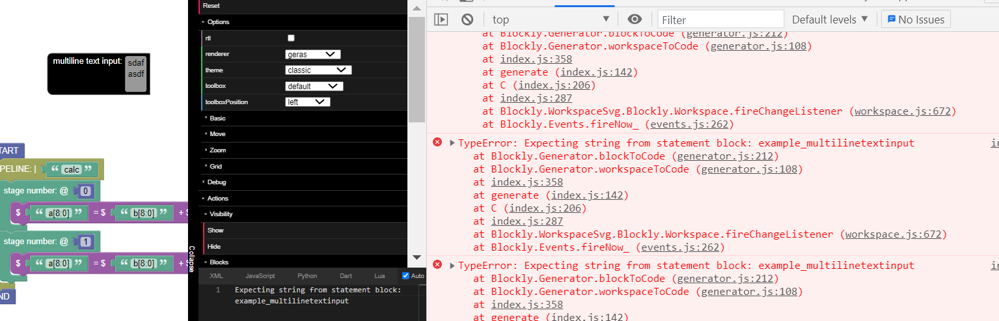
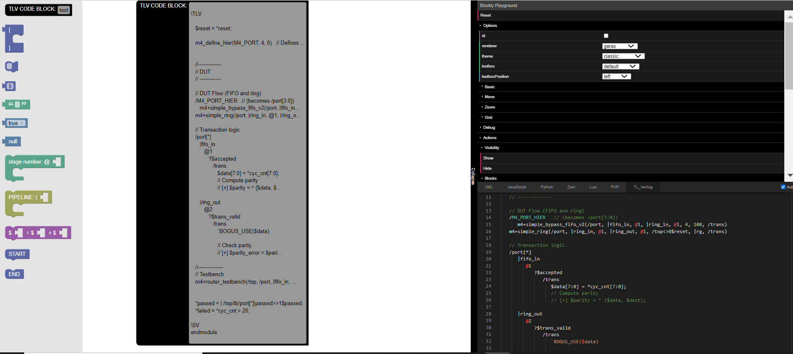
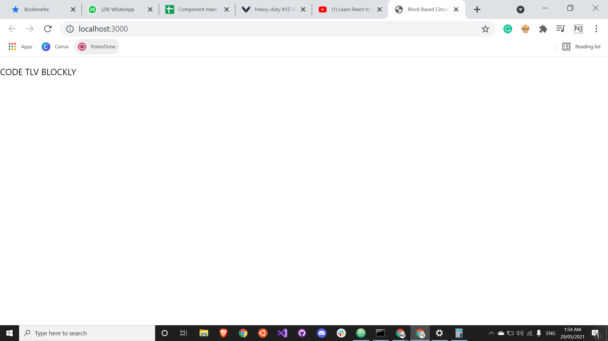
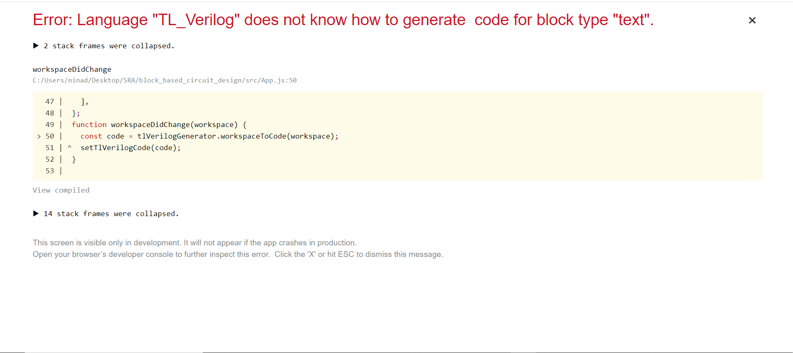

/ [Home](/index) / [Tracker](/gsoc-2021) / [About](pages/gsoc/about) / [TL-Verilog](pages/gsoc/TLV) / [Blogs](pages/blogs/gsoc-final-blog) /

---

### Week 0.2

---

1. **27/05/2021:** 
   * Multiline text is not available as a type in Block Factory but it has been added to the developer docs. Seems like a recent feature, the blockly google groups have people trying to code this on their own.
   * Another source for multiline input in the Blockly core. An undocumented option: 
          - from issue:  https://github.com/google/blockly/issues/3939
          - https://github.com/google/blockly/blob/master/core/field_multilineinput.js
   * Went through learn to react website: 

     
   
  

2. **28/05/2021:**
   * React is looking a little less scary now. I guess the more I look at a framework the less scary it looks. I have had a slow start to React, TBH I feel, its like that for most things with me, I spend the first few days just getting a feel for stuff, slow starter. Its fine, language is just a way of saying things, what matters is the logic, and Ill get the hang of the language as I work with it more. 
  <h6 align="center">A Small Start </h6>

     
   

3. **29/05/2021:**
   * Added new long term deliverables:
   * Remove verbose words from commands-(keep just |, @, ...)
   * Modify Expressions -(assign keyword)
   * Add connections to the TLV Code Block
   * Adding hierarchy
   * Adding when 
   * Adding scope- (dropdown with path references)
   * Adding error handling
 <h6  align="center" > Stuck here </h6> 

     
   

4. **30/05/2021:**
   * Took Off : Birthday
    
5. **31/05/2021:**
   * Took Off: Vaccine + Sick due to Vaccine
    
6. **1/06/2021:**
   * Took Off: Sick due to Vaccine
    
7. **2/06/2021:**
   * Took Off: Sick due to Vaccine
