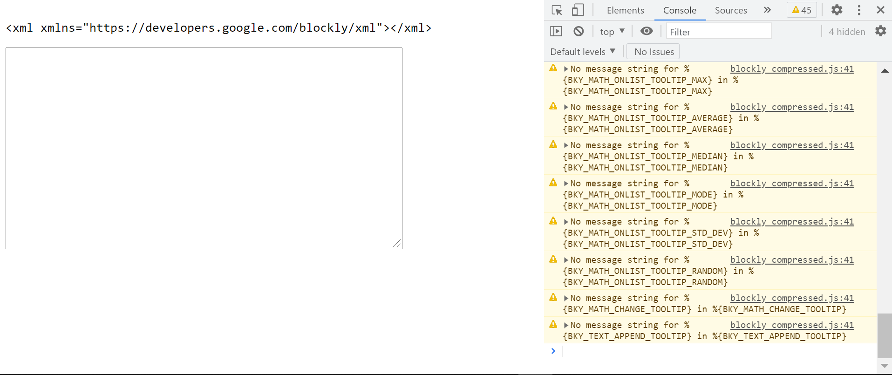
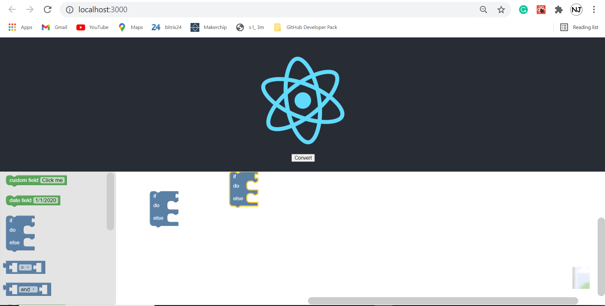
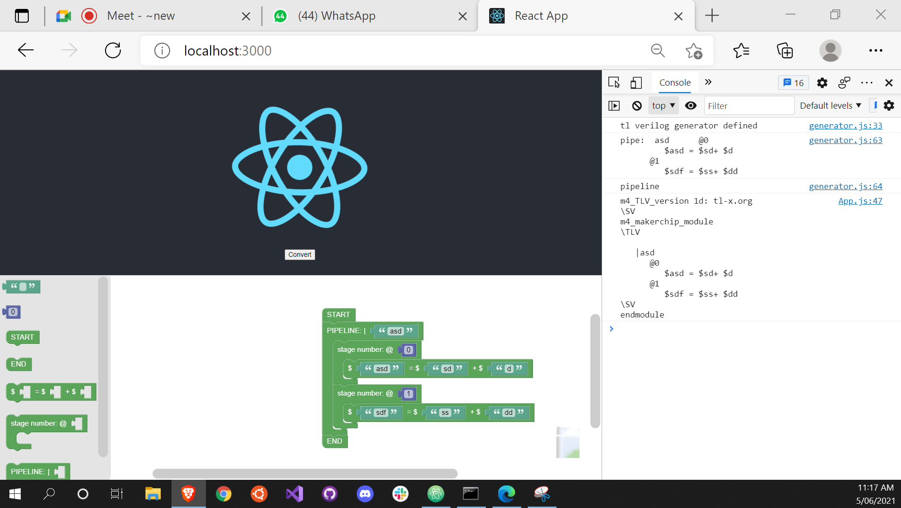
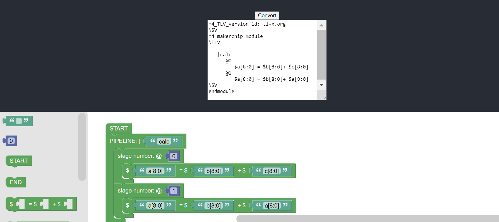
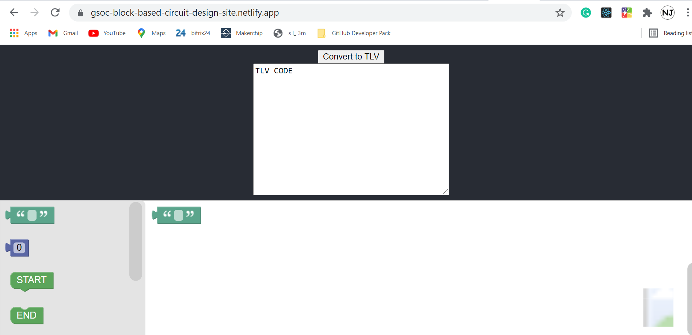
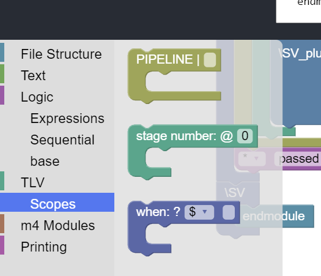
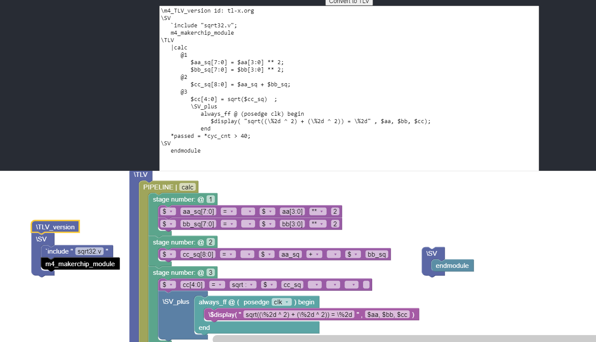
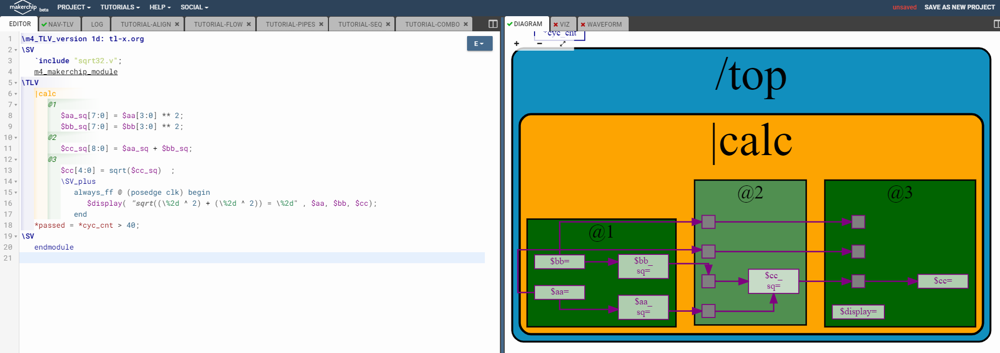

/ [Home](/index) / [Tracker](/gsoc-2021) / [About](pages/gsoc/about) / [TL-Verilog](pages/gsoc/TLV) / [Blogs](pages/blogs/gsoc-final-blog) /

---

### Week 1

---

1. **3/06/2021:** 
   * removed the base errors got a text area running for the code display
   * couldn’t find the procedure to use a custom language generator with the package
   * https://github.com/OttoDIY/blockly has made a good blockly website for C++ but I can’t find the source code for his website on the repo.
    
 
       
     

2. **4/06/2021:**
   * Cloned the base blockly-react framework:
   * This is the starting point from here I will integrate the tl_verilog generator. 
   * added custom blocks, overwritten: will check. 
   * git update at this pt: "generator-custom-blocks-buggy"
       
 
       
     

3. **5/06/2021:**
   *  I had a code along with Adam and steve to mainly fix the generator issue, I was unable to get the generator recognised by blockly. 
   *  The fix was basically defining a constructor for tlVerilogGenerator within the generator.js and using a specific import tlVerilogGenerator from “../tlVerilog/tl_verilog” into the scripts
   *  Now the next challenge is putting the code in a textarea.
   *  Still getting bugs with creating an output text area mostly cause I used classes I am unable to use hooks:
     
 
       
     

4. **6/06/2021:**
   * Was able to finally connect the textarea to the code, most of the official documentation on the code is to make it operate like an input box. being able to operate it as output was good.
   * I basically defined an object state with a member value, then I use setState() to change the state when the Convert button is called by linking the generateCode() to the onChange and setting the textarea value to the state value  
          <textarea  value ={this.state.value} onChange={this.generateCode} />
    
 
       
     

5. **7/06/2021:**
   * Looking into how to convert code to blockly:
   * HOSTED THE WEBSITE TO NETLIFY
   * Learning about react in depth:
   * Had a meet with Steve:
     - How can we get from TLV to blockly-TLV. If there is an input format, I can add support for Blockly-TLV output to SandPiper. CODE-> BLOCKLY
     - How can we integrate Blockly-JS with Blockly-TLV to support Blockly-TLV-VIZ. BLOCKLY -> \viz_alpha 
    
 
       
     

6. **8/06/2021:**
   * Commands to deploy to the website:
     - npm run build
     - netlify deploy  
       * ./build
     - netlify deploy --prod  
       * ./build

7. **9/06/2021:**
   * Started doing MYTH Workshop. Watched Lectures and did assignments and labs. 
   * Coded the Pythagorean example using blockly
   * Added 10+ blocks from file structure blocks to logic blocks and scope 
      
 
       <b>New blocks</b> 
        
       <b>Pythaorean Ex in Blockly</b> 
        
       <b>Testing Code in MakerChuip</b> 
       
     
 

