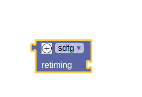

/ [Home](/index) / [Tracker](/gsoc-2021) / [About](pages/gsoc/about) / [TL-Verilog](pages/gsoc/TLV) / [Blogs](pages/blogs/gsoc-final-blog) /

---

### Week 10

---

    <a align = "left" href = "./wk9.md"> < Prev </a> 
      /
    <a  href = "./wk11.md"> Next > </a>  
  

1. **5/08/2021:** 
   * Added new blocks: \always_comb,ANY, RETAIN
   
     
     
     
   

   
2. **6/08/2021:**
   * Utilised the JS Generator to use JS Blocks with a future goal of integrating viz_alpha into it.
   
     
     
   

3. **7/08/2021:**
   * Fixed the hanging scrollbar by hiding it for now. Using the following code in App.css (Temporary Fix)
   * .blocklyScrollbarHandle {
                               fill: #ccc;
                               display: none;
                            }

4. **8/08/2021:**
   * Separated Toolbox from Main.js into a new toolbox.js.
   
5. **9/08/2021:**
   * Did a mutator in blockly but I was not able to get the correct look and feel for it. Today researched on the control_if code in nodemodules of blockly and realised I had not written compose and decompose functions. Ill learn them and add them. Basically have an editor ui for block mutation like the if else blocks in core blockly.
   * ChakraProvider tag still makes the html to 292 px in height. Couldnt find a fix to that. Will ask Adam when we have our meet.
   * Saw a little more into JS generator as I will be working with that in viz. Blocks.

   
6. **10/08/2021:**
   * Tried to add a varying field
   * Getting error while dragging blocks after mutating the block
   
     
     
   

   
7. **11/08/2021:**
   * Fixed the height of the div issue by creating a new component, Panel.js, where ChakraProvider is used without affecting the blockly-div and then extending the TextArea inside it.
   *  <Textarea
        id="textarea" w="95%" h ="700px" variant="outline" value={value} size="bg" onChange={manualtext} />

   
