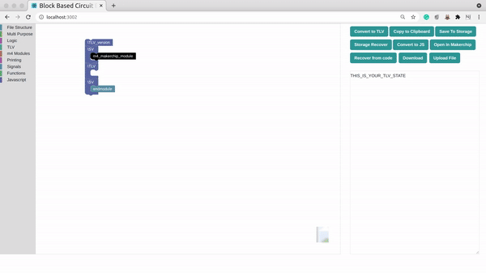
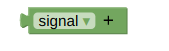
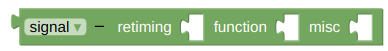
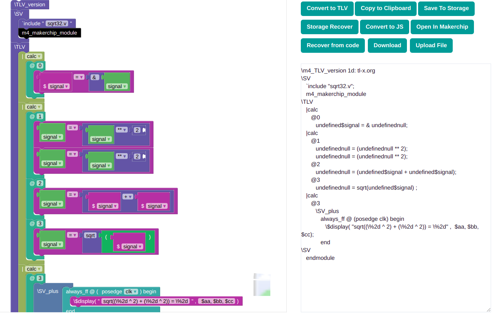

/ [Home](/index) / [Tracker](/gsoc-2021) / [About](pages/gsoc/about) / [TL-Verilog](pages/gsoc/TLV) / [Blogs](pages/blogs/gsoc-final-blog) /

---

### Week 11

---

1. **12/08/2021:** 
   * Completed the basic signal using mutators and extensions
   * CODE TO GET MUTATORS WORKING: generator/signal.js (Terrible documentation online)
   
     
      
   

2. **13/08/2021:**
   * Trying to Lift state Up, blocklydiv works but toolbox throws container error.
   * Error: Toolbox must have a contents attribute.
   
3. **14/08/2021:**
   * 	Played with mutators, trying to get ternary operator mutator working. Got 

4. **15/08/2021:**
   * Added pipesignal, statesignal, assginedstatesignal, ... 
   * Lifted state up. Deleted Main.js and integrated all files with App.js
5. **16/08/2021:**
   * Added open in makerchip button. 
    
6. **17/08/2021:**
   * Made Mutators inline, they have 3 inputs
     * retiming
     * type
     * function
   
     
      
      
   

7. **18/08/2021:**
   * Redesigned Signal Block and calibrated its inputs for the sleekest design during coding. 
   
     
      
   

