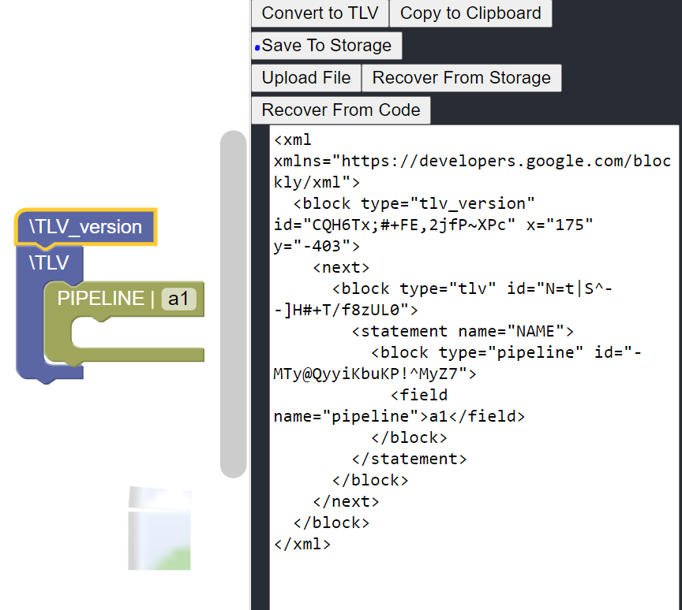
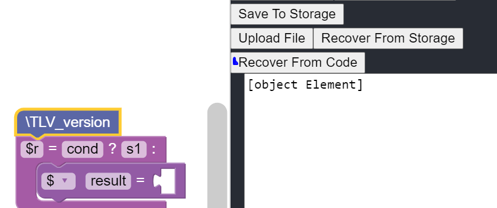

/ [Home](/index) / [Tracker](/gsoc-2021) / [About](pages/gsoc/about) / [TL-Verilog](pages/gsoc/TLV) / [Blogs](pages/blogs/gsoc-final-blog) /

---

### Week 2

---

    <a align = "left" href = "./wk1"> < Prev </a> 
      /
    <a  href = "./wk3"> Next > </a>  
  

---

<b> Note: </b> [Completed RISCV Core MYTH WORKSHOP](https://github.com/ninja3011/riscv-cpu-core)

---

1. **10/06/2021:** 
   * Redesigned Layout to a Vertical column layout with three portions(toolbox, workspace, textArea+buttons) for better aesthetics and ease of programming. 
   * Put the code in Main.js, just using <Main /> in App.js for easy migration to warp-v.org later. 

2. **11/06/2021:**
   * Added Blocks to XML and XML to Blocks functionality.
   * Added Save to Local Storage and Recover from Local Storage functionality for ease of development.
 <h5  align="center" > Blockly to TLV </h5>

     
   

 <h5  align="center" > XML to Blockly </h5>

     
   

3. **12/06/2021:**
   * Changed TextArea to accept Inputs. A simple copy-paste of XML to the textArea and ‘Recover from Code’ will also generate the blocks, without needing to import from a program.
   * Added an Upload File button for uploading and loading a Blockly block program file (.xml) which generates the corresponding block structure. 
4. **13/06/2021:**
   * Added New Blocks and redesigned a lot of existing blocks to better fit programming with blockly. ( Added m4+, m4_include_lib,...(m4 blocks); arithmetic_operator, logical_operator, ..(operation blocks), ternary operators, ..)
5. **14/06/2021:**
   * MAJOR FIX: Till now all the indentation was done by hardcoded strings. I was calculating each indent and harcoding it into the blocks. Now It is being done by Generator class property Indent.
6. **15/06/2021:**
   * Redesigned existing blocks to use dummy inputs and fields instead of valueinput blocks. This will allow the user to type into the block without having to drag a text/number input for each slot
7. **16/06/2021:**
   * Completed the MYTH RISCV Core
