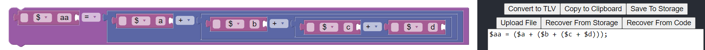
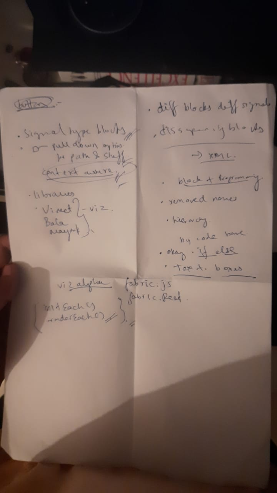
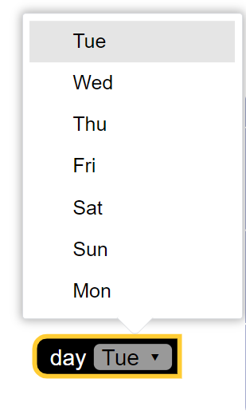
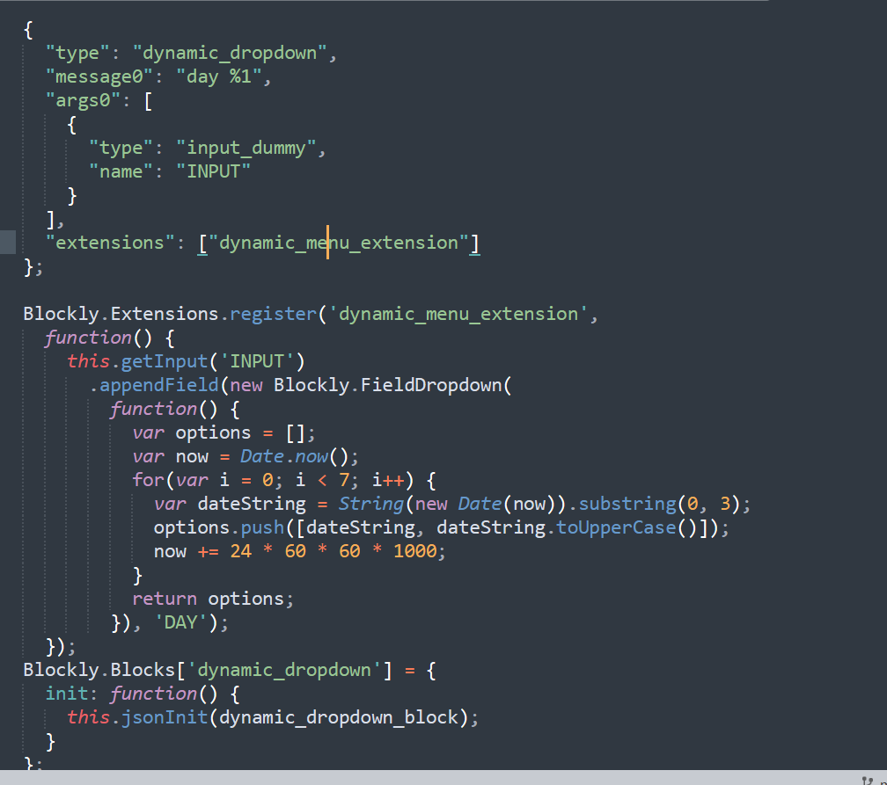

/ [Home](/index) / [Tracker](/gsoc-2021) / [About](pages/gsoc/about) / [TL-Verilog](pages/gsoc/TLV) / [Blogs](pages/blogs/gsoc-final-blog) /

---

### Week 3

---

    <a align = "left" href = "./wk2"> < Prev </a> 
      /
    <a  href = "./wk4"> Next > </a>  
  

1. **17/06/2021:** 
   * Documented the RISCV CPU Core from Myth Workshop
2. **18/06/2021:**
   * Nested SubStatement Blocks (logic) like seen in Scratch with Steve
   * updated the Notes and Planners for the previous week
   * Looked into Variables for Blockly, IDK what they are yet exactly in terms of code, just a gut feeling that we need them.

     
   

3. **19/06/2021:**
   * Fixed bugs in last weeks updates
4. **20/06/2021:**
   * Redesigned Ternary Operators
   * Today I looked into using variables instead of text inputs for signals. Made a few blocks not integrated yet. Also solved a minor DOM exception that comes up. Still a few pop up. Some errors that crash the site locally.  But on the url it just keeps running. Will see it tomorrow. Also saw a little of viz alpha will try it out a little in blockly tomorrow.
   * Had a call with steve
  
     
     
  

5. **21/06/2021:**
   * [Dynamic Dropdown](https://groups.google.com/g/blockly/c/7gby26zv3MA)
   * After the call with Steve yesterday. I felt like it was a good moment to go back and skim through the BLockly guides again. I found a good solution for one of the problems. The dropdown showing signals and hierarchies needed to be customized on the fly according to the blocks in the program. I havent implemented it yet, just playing around with a new field I found, the dynamic_dropdown along with a Blockly class Extensions which allows me to set the options of the dropdown with a self-defined-function. Will translate this to our blocks to make the dropdown lists context aware.
   * Taking another day to get through the documentation once again to pick up things might have missed earlier, in order to achieve some of the things discussed in the call.
  
     
    
     
  

6. **22/06/2021:**
   * Solutions for problems:
     - retiming: clickable images
     - dropdown scope: extensions 
     - syntax: validators
     - auto changing value blocks: mutators

7. **23/06/2021:**
   * Added proper extensions for creating scope signals 
