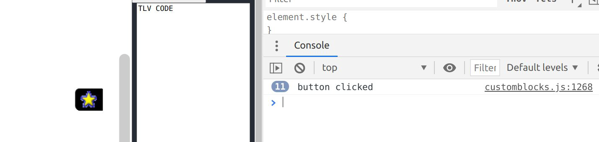

/ [Home](/index) / [Tracker](/gsoc-2021) / [About](pages/gsoc/about) / [TL-Verilog](pages/gsoc/TLV) / [Blogs](pages/blogs/gsoc-final-blog) /

---

### Week 4

---

1. **24/06/2021:** 
   * Employed a very implistic permutations algortihm which creates all combinations for scope.
   * I need to make it smart, make sure only the relevant scopes come

     
   

2. **25/06/2021:**
   * Researched on clickable buttons
   * There are no buttons in blockly, double-checked
   * How to implement a clickable image in blockly
   * Tried implementing
     - https://developers.google.com/blockly/guides/create-custom-blocks/fields/built-in-fields/image#creation
     - But failed, one general opinion I found on the net was the JSON Blocks still hadn’t gotten the logic for an onClick Functionionality set in.
     - Need to see more

3. **26/06/2021:**
   * Took a day off to go on a Trek
4. **27/06/2021:**
   * Rewrote some of the code, In a git error and stuff I used force and some parts of my code got washed out
   * Also, there seem to be conflicts, sorting that out
   * Found the Answer!
     - https://groups.google.com/g/blockly/c/rzcpN8iIrRU
     - Basically using extensions again and using a click handler on the image block.
     - the png acts as a field and we get that field and see click event on that.

     
   

5. **28/06/2021:**
   * Made retiming block
   * References:
     - [https://developers.google.com/blockly/reference/js/Blockly.Field](https://developers.google.com/blockly/reference/js/Blockly.Field)
     - [https://groups.google.com/g/blockly/c/sH-MhfGsXX4](https://groups.google.com/g/blockly/c/sH-MhfGsXX4)

     
   

6. **29/06/2021:**
   * Added the clickable button blocks for the retiming. 
7. **30/06/2021:**
   * Today was basically a little studying again. Failed at getring the block change field on input
   *  working on validators for the scope.
   *  getting stuck with adding variables. tlVerilogGenerator.varableDB_ is coming undefined
   *  References
      - [https://github.com/google/blockly/issues/4060](https://github.com/google/blockly/issues/4060)
      - [https://groups.google.com/g/blockly/c/k56NRUfu-5U/m/QlZIQUuaAwAJ](https://groups.google.com/g/blockly/c/k56NRUfu-5U/m/QlZIQUuaAwAJ)

     
   

      
