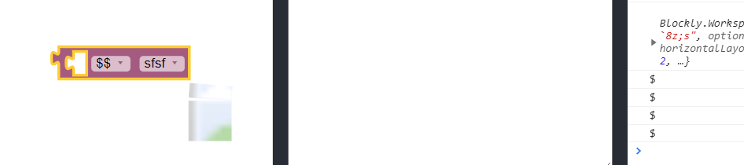

/ [Home](/index) / [Tracker](/gsoc-2021) / [About](pages/gsoc/about) / [TL-Verilog](pages/gsoc/TLV) / [Blogs](pages/blogs/gsoc-final-blog) /

---

### Week 5

---

1. **1/07/2021:** 
   * Added variableDB_ scrubber in the tl_verilog.js - the logic required by the tlVerilogGenerator to handle variable generation and operations
  
     
     
  

  
2. **2/07/2021:**
   * Added Procedures referring [tutorial](https://oucc.uk/index.php?action=content&id=47)
3. **3/07/2021:**
   * this.getfieldvalue not returning proper values for the variable data. Worked on fixing the variable logic
  
     
     
  

  
4. **4/07/2021:**
   * Completed a [course](https://scrimba.com/learn/learnreact#) on React with coding all examples
   
     
     
  
  
  
5. **5/07/2021:**
   * REACT LINKS STUDIED:
      * [Official React Context API](https://reactjs.org/docs/context.html)
      * [Error Boundaries](https://reactjs.org/docs/error-boundaries.html)
      * [render props](https://reactjs.org/docs/render-props.html)
      * [Higher Order Components](https://reactjs.org/docs/higher-order-components.html)
      * [React Router](https://reacttraining.com/react-router/core/guides/philosophy)
      * [React Hooks](https://reactjs.org/docs/hooks-intro.html)
      * [React lazy, memo, and Suspense]( https://reactjs.org/blog/2018/10/23/react-v-16-6.html)
      * [cosmicjs](https://github.com/cosmicjs/simple-react-blog/blob/master/pages/post.js)
      * [fetch](https://developer.mozilla.org/en-US/docs/Web/API/WindowOrWorkerGlobalScope/fetch)
      * [forms](https://reactjs.org/docs/forms.html)
      * [smart components](https://medium.com/@dan_abramov/smart-and-dumb-components-7ca2f9a7c7d0)
      * [lifecycles](https://reactjs.org/blog/2018/03/29/react-v-16-3.html#component-lifecycle-changes)

6. **6/07/2021:**
   * Starting to add custom categories. [Reference](https://groups.google.com/forum/#!topic/blockly/MmGnFkfFXaI)
   
     
     
  
  

7. **7/07/2021:**
   * Working on developing a dynamic toolbox :
     * [google group](https://developers.google.com/blockly/guides/configure/web/toolbox)
     * [Github Issue ](https://github.com/google/blockly/issues/872)

