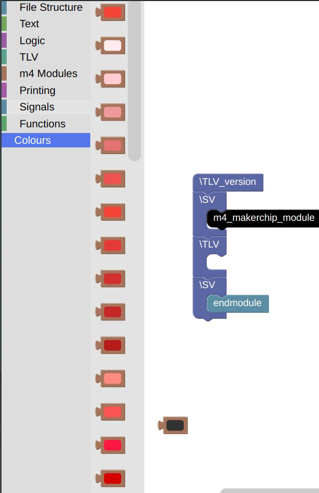
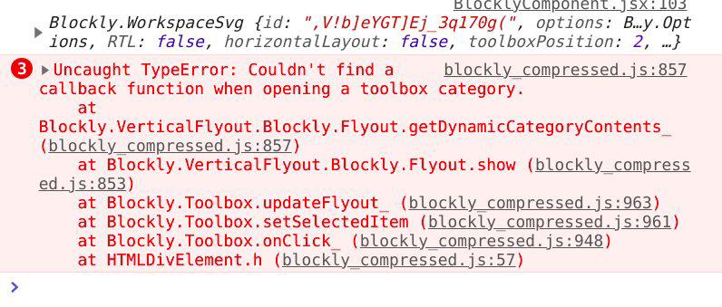
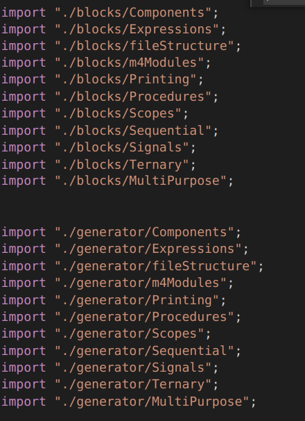
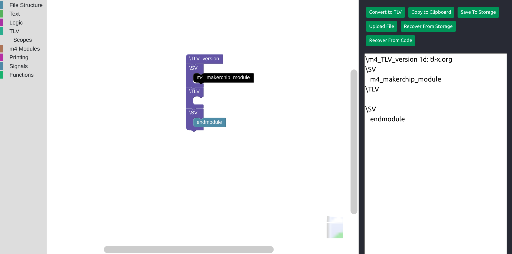
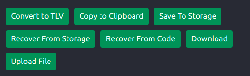

/ [Home](/index) / [Tracker](/gsoc-2021) / [About](pages/gsoc/about) / [TL-Verilog](pages/gsoc/TLV) / [Blogs](pages/blogs/gsoc-final-blog) /

---

### Week 6

---

**Note:** RESTRUCTURING CODE FROM SCRATCH

---

    <a align = "left" href = "./wk5"> < Prev </a> 
      /
    <a  href = "./wk7"> Next > </a>  
  

1. **8/07/2021:** 
   * Got a dynamic category working but couldnot use getPallete
   * Written the code for pipesignal but its not registering the clicks yet. 
  
     
     
     
  

2. **9/07/2021:**
   * Started Restructuring code from scratch
   * References:
   * useRef:
     * [useref vs createref](https://stackoverflow.com/questions/54620698/whats-the-difference-between-useref-and-createref)
   * Embedding div:
      * [fixed size div](https://developers.google.com/blockly/guides/configure/web/fixed-size)
     *  [resizable div](https://neil.fraser.name/blockly/installation/injecting-resizable)
     * [Google Groups]( https://groups.google.com/g/blockly/c/QxU-WBXhgdU)
     * [configuration on struct](https://developers.google.com/blockly/guides/configure/web/configuration_struct)
     * [article](https://www.programmersought.com/article/84673789062/)
     * [container not in document]( https://stackoverflow.com/questions/45227309/uncaught-error-container-is-not-in-current-document)
     
3. **10/07/2021:**
   * converted all the React.createRefs to useRefs and componentDidMount to useEffects
   * Overuse of references is considered bad coding. HTML DOM operations where refs were previously used like textArea. The errors in Save Workspace and Copy to clipboard have been resolved
4. **11/07/2021:**
   * es5 -> es6 syntax conversion
   * 
5. **12/07/2021:**
   * CSS -> Bootstrap Styling.
   * Fixed the BlocklyDiv, Save Workspace, TextArea, BlocklyComponent and index.js of BlocklyComponent.
   * Reorganised the file structure. broke blocks.js and generator.js to individual files by catgories for a cleaner code. 
  
     
     
  

  
6. **13/07/2021:**
   * Fixed the buttons except handlefileupload, I am not using a reference there anymore as they were causing issues in my previous versions. Even handleFileUpload is almost working, I am getting my program uploaded on console.log, its just an issue of the workspace render. By tomorrow morning the code will reach a stable version. safe side for tomorrows presentation.
   * Added Download Button
  
     
     
     
  

7. **14/07/2021:**
   * Started Experimenting and Reasearching on Mutators
   * [Google Groups](https://groups.google.com/g/blockly/c/hnhObVXLJw4)
   * USE THIS:
      *  [plus mius plugin](https://github.com/google/blockly-samples/tree/master/plugins/block-plus-minus/test)
      * [variable modal plugin](https://www.npmjs.com/package/@blockly/plugin-typed-variable-modal)

