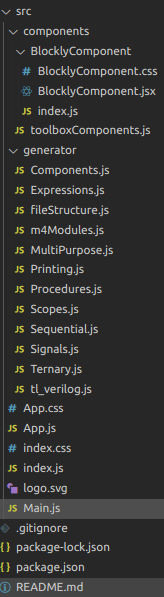

/ [Home](/index) / [Tracker](/gsoc-2021) / [About](pages/gsoc/about) / [TL-Verilog](pages/gsoc/TLV) / [Blogs](pages/blogs/gsoc-final-blog) /

---

### Week 8

---

1. **22/07/2021:** 
   * Completed merging blocks and generator scripts
     
 
       
     

   * Getting an error on dragging blocks. Will rectify it by tomorrow
     
 
       
     

2. **23/07/2021:**
   * Fixed dragging blocks error. 
   * Worked on Delta Electronics Competition

3. **24/07/2021:**
   * Worked on Delta Electronics Competition

4. **25/07/2021:**
   * Worked on Delta Electronics Competition
   * Received 2nd Prize. 

5. **26/07/2021:**
   * Redefining logic for the generator functions.
6. **27/07/2021:**
   * Changed functions to es6
   * Changed css to JS object css

7. **28/07/2021:**
   * Removed .css files
   * Worked on using global context or pass state instead of modifying props
   * Recalibrated functions for Panel Functionality.
      
 
       
     

